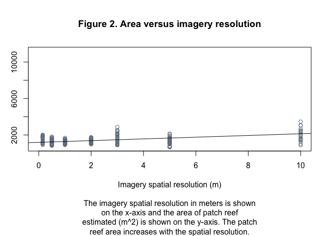

MBIO630_GroupProject_MeasuringReefs
================
Kyleigh Kuball
2022-09-28

## Introduction

Satellite imagery is a powerful tool used to study animal populations
and tree cover and is slowly expanding to use in other areas of study
(LaRue, Stapleton, & Anderson 2017). Satellite imagery has been used to
study fish populations and coral reef structures (Madin & Foley 2021;
Madin & Madin 2015). Further studies will continue to use satellite
imagery and spatial resolution to measure features pertinent to research
areas (Madin & Madin 2015). Moving forward, it is essential to
understand how satellite imagery spatial resolution affects measurements
of research data within research sites. This study looked at three
measurement methods (GPS, transect, and satellite data) regarding the
benefits and disadvantages of each technique.

## Materials & Methods

This study was conducted in Kāneʻohe Bay, Hawaiʻi, at reef patches 20
and 22. Transect and GPS data was taken by two groups of 3 snorkelers
swimming the perimeter of each patch reef. Transects were laid out end
over end to measure the circumference, while one person in the group of
3 followed with a GPS. Satellite imagery was taken from multiple dates
via Google Earth Pro (v.7.3.4.8642) and Planet Explorer. Perimeter
within the satellite data was taken using the polygon tool in both
instances and then calculated the area of a circle
(((perimeter/(2*PI()))^2)*PI()) via Excel(v. 16.65). All data was then
compiled into R Studio (v. 2022.07.1) for analysis.

## Results

Overall, Figure 1 illustrates that GPS has a higher estimate of area,
and imagery has a lot of outliers. It is quite variable, and the
transect data appears to have the least outliers and most minor
averages. However, the average between imagery and transect seems to be
similar. Figure 2 illustrates the significant correlation (t = 9.43, p =
\<2e-16) that the better the imagery resolution, the smaller the
estimate for the patch reef area. The area is estimated to be greater
when the resolution is poor. A significant correlation was found between
the resolution and the perimeter (t = 8.493, p = 2.32e-15); Figure 3
illustrates this correlation that the greater the resolution, the
greater the perimeter estimate. Figure 4 shows that the reef is
increasing in the area as time increases. The linear model run shows
that this increase shown in Figure 4 is statistically significant (t =
3.209, p = 0.00151).

Imagery resolution (t = -2.780, p = 0.00588) and year (t = -2.230, p =
0.02673) both had a significant correlation with the area and there was
a significant correlation between imagery resolution and year (t =
2.785, p = 0.00579). An Analysis of Variance revealed that year may not
be a significant variable when isolated from imagery resolution;
however, when the drop1 function was used, no parameters were suggested
to be dropped.

The relationship between reef number and area is significant (t = -2.95,
p =0.0059), and there is a negative correlation between the two due to
reef 22 having a decline in the area compared to reef 20. There appears
to be no significant interaction between imagery resolution and reef
number, but there is a significant correlation between imagery
resolution and area (t = 3.96, p = 0.00039). This means that the
variation in the imagery resolution is not significantly correlated to
the reef number but is significant when calculating the area at either
reef.

<!-- -->

    ## 
    ## Call:
    ## lm(formula = area_m2 ~ imagery_resolution_m, data = data)
    ## 
    ## Residuals:
    ##     Min      1Q  Median      3Q     Max 
    ## -2851.6  -339.9   -55.7   281.4  7194.2 
    ## 
    ## Coefficients:
    ##                      Estimate Std. Error t value Pr(>|t|)    
    ## (Intercept)          1193.273     68.706   17.37   <2e-16 ***
    ## imagery_resolution_m   93.774      9.944    9.43   <2e-16 ***
    ## ---
    ## Signif. codes:  0 '***' 0.001 '**' 0.01 '*' 0.05 '.' 0.1 ' ' 1
    ## 
    ## Residual standard error: 896.7 on 235 degrees of freedom
    ##   (53 observations deleted due to missingness)
    ## Multiple R-squared:  0.2745, Adjusted R-squared:  0.2714 
    ## F-statistic: 88.93 on 1 and 235 DF,  p-value: < 2.2e-16

<!-- -->

    ## 
    ## Call:
    ## lm(formula = perimeter_m ~ imagery_resolution_m, data = data)
    ## 
    ## Residuals:
    ##     Min      1Q  Median      3Q     Max 
    ## -83.799 -15.751  -1.632  13.949 170.901 
    ## 
    ## Coefficients:
    ##                      Estimate Std. Error t value Pr(>|t|)    
    ## (Intercept)          126.2717     2.1151  59.701  < 2e-16 ***
    ## imagery_resolution_m   2.5999     0.3061   8.493 2.32e-15 ***
    ## ---
    ## Signif. codes:  0 '***' 0.001 '**' 0.01 '*' 0.05 '.' 0.1 ' ' 1
    ## 
    ## Residual standard error: 27.6 on 235 degrees of freedom
    ##   (53 observations deleted due to missingness)
    ## Multiple R-squared:  0.2349, Adjusted R-squared:  0.2316 
    ## F-statistic: 72.13 on 1 and 235 DF,  p-value: 2.317e-15

<!-- -->

    ## 
    ## Call:
    ## lm(formula = area_m2 ~ as.numeric(year), data = data)
    ## 
    ## Residuals:
    ##    Min     1Q Median     3Q    Max 
    ## -991.6 -438.5 -130.0  213.5 9438.9 
    ## 
    ## Coefficients:
    ##                   Estimate Std. Error t value Pr(>|t|)   
    ## (Intercept)      -78739.97   25015.49  -3.148  0.00185 **
    ## as.numeric(year)     39.87      12.42   3.209  0.00151 **
    ## ---
    ## Signif. codes:  0 '***' 0.001 '**' 0.01 '*' 0.05 '.' 0.1 ' ' 1
    ## 
    ## Residual standard error: 1020 on 243 degrees of freedom
    ##   (45 observations deleted due to missingness)
    ## Multiple R-squared:  0.04066,    Adjusted R-squared:  0.03671 
    ## F-statistic:  10.3 on 1 and 243 DF,  p-value: 0.00151

Further analysis:

    ## 
    ## Call:
    ## lm(formula = area_m2 ~ imagery_resolution_m * year, data = data)
    ## 
    ## Residuals:
    ##     Min      1Q  Median      3Q     Max 
    ## -3138.6  -329.6   -60.4   277.4  6907.3 
    ## 
    ## Coefficients:
    ##                             Estimate Std. Error t value Pr(>|t|)   
    ## (Intercept)                94061.858  41612.411   2.260  0.02472 * 
    ## imagery_resolution_m      -50744.552  18253.543  -2.780  0.00588 **
    ## year                         -46.031     20.646  -2.230  0.02673 * 
    ## imagery_resolution_m:year     25.186      9.043   2.785  0.00579 **
    ## ---
    ## Signif. codes:  0 '***' 0.001 '**' 0.01 '*' 0.05 '.' 0.1 ' ' 1
    ## 
    ## Residual standard error: 885.9 on 233 degrees of freedom
    ##   (53 observations deleted due to missingness)
    ## Multiple R-squared:  0.2979, Adjusted R-squared:  0.2889 
    ## F-statistic: 32.95 on 3 and 233 DF,  p-value: < 2.2e-16

    ## Analysis of Variance Table
    ## 
    ## Response: area_m2
    ##                            Df    Sum Sq  Mean Sq F value    Pr(>F)    
    ## imagery_resolution_m        1  71500862 71500862 91.1054 < 2.2e-16 ***
    ## year                        1        90       90  0.0001  0.991445    
    ## imagery_resolution_m:year   1   6087718  6087718  7.7569  0.005791 ** 
    ## Residuals                 233 182861770   784814                      
    ## ---
    ## Signif. codes:  0 '***' 0.001 '**' 0.01 '*' 0.05 '.' 0.1 ' ' 1

    ## Single term deletions
    ## 
    ## Model:
    ## area_m2 ~ imagery_resolution_m * year
    ##                           Df Sum of Sq       RSS    AIC F value   Pr(>F)   
    ## <none>                                 182861770 3220.8                    
    ## imagery_resolution_m:year  1   6087718 188949488 3226.6  7.7569 0.005791 **
    ## ---
    ## Signif. codes:  0 '***' 0.001 '**' 0.01 '*' 0.05 '.' 0.1 ' ' 1

Analysis on reef identity (reef number):

    ## 
    ## Call:
    ## lm(formula = area_m2 ~ imagery_resolution_m * reef_no, data = na.omit(data))
    ## 
    ## Residuals:
    ##    Min     1Q Median     3Q    Max 
    ## -383.0 -175.8  -51.6  150.5  624.9 
    ## 
    ## Coefficients:
    ##                              Estimate Std. Error t value Pr(>|t|)    
    ## (Intercept)                   5712.92    1441.86   3.962 0.000389 ***
    ## imagery_resolution_m           437.65     563.58   0.777 0.443118    
    ## reef_no                       -202.26      68.58  -2.949 0.005912 ** 
    ## imagery_resolution_m:reef_no   -23.61      26.81  -0.881 0.384939    
    ## ---
    ## Signif. codes:  0 '***' 0.001 '**' 0.01 '*' 0.05 '.' 0.1 ' ' 1
    ## 
    ## Residual standard error: 267.9 on 32 degrees of freedom
    ## Multiple R-squared:  0.5319, Adjusted R-squared:  0.488 
    ## F-statistic: 12.12 on 3 and 32 DF,  p-value: 1.835e-05

## Discussion

This study looked at how spatial resolution affects research subject
areas. Overall, we found that resolution can greatly affect the
perimeter and location of a site, with imagery data being far more
variable among individuals. In contrast, the field/transect data seemed
to have significantly fewer outliers than the imagery data. The
measurements of each reef tended to increase as the resolution became
poorer, likely due to difficulty determining the edges of each patch
reef. An interesting find in this data set was that given that the
spatial imagery resolution gets smaller and better with time, the size
of the patch reefs would be assumed to decrease as time increases based
on the figures in this study (Figures 2&3). Because of the resolution
getting better, if the reef were not growing or changing, the edges
would be easier to identify so that the area would decrease (Figures 2 &
3). Considering that it is increasing, there is likely substantial
growth since the resolution increase should work against the
measurements taken.

In all, there is a balance between imagery measurements and field
measurements. Imagery measurements are far less time-consuming and
costly than field data, and more dates and times may be available to
compare. However, the field/transect data tends to be much more
accurate, with fewer outliers than the imagery data, which would be
necessary for specific research projects. The imagery platform trade-off
seems to be the difference in price with the difference in resolution.
The lower resolution platforms had more variability among groups and
were far less accurate; however, that is the least expensive long-term
method to monitor the reef. As the resolution increases, the price
increases, and it starts to balance whether it is less costly to be in
the field or use the imagery data. More data is available in low
resolution than in high resolution. High resolution tends to be
expensive, and sometimes the clouds cover the area of interest. Pictures
are taken more often with low resolution, so cloud cover isn’t as
troublesome and is less expensive. However, the area estimate
variability increases significantly as the resolution becomes poorer.

## References

LaRue, M. A., Stapleton, S., & Anderson, M. (2017). Feasibility of using
high‐resolution satellite imagery to assess vertebrate wildlife
populations. Conservation biology, 31(1), 213-220.

Madin, E. M., & Foley, C. M. (2021). The Shift to a Bird’s-Eye View:
Remote sensing technologies allow researchers to track small changes on
a large scale and enable studies of far-flung places from the comfort
and safety of home. American Scientist, 109(5), 288-296.

Madin, J. S., & Madin, E. M. (2015). The full extent of the global coral
reef crisis. Conservation Biology, 29(6), 1724-1726.
